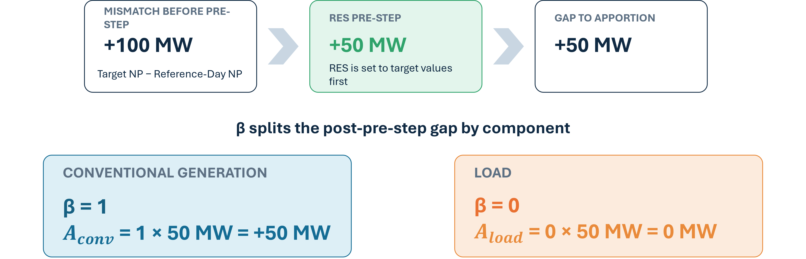
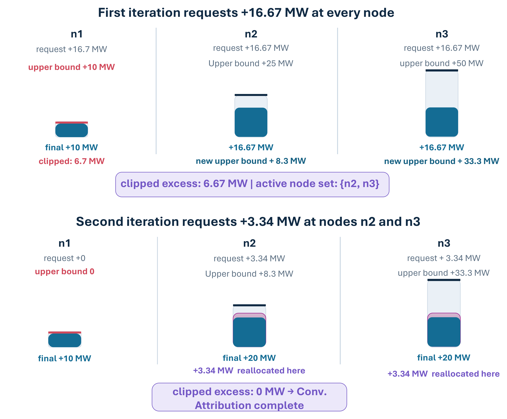

# FBMC Reference-Day Basecase

Flow-based market coupling (FBMC) requires a *basecase*: a forecast of the nodal
injections and line flows expected on the delivery day, from which the zonal PTDF and the
Remaining Available Margins (RAM) of the flow-based domain are derived. In the European
CWE/Core process this forecast is the **D2CF** (Two-Days-Ahead Congestion Forecast), which
TSOs build not by solving an optimization problem but by taking a *reference day* — a
recent, similar day — and adjusting it toward the expected conditions of the delivery day.

POMATWO supports two ways to obtain the basecase for a `ZonalMarket(FlowBased(...))` run:

- [`OptimizationBasecase`](@ref) (default): solve the `TwoDayAhead` optimization state — a
  clean but idealized proxy in which the basecase is itself a market-optimal dispatch.
- [`ReferenceDayBasecase`](@ref) (this page): mimic the D2CF process. Match every target
  day to a similar day of a previous ("forecast") model run and *shift* that day's nodal
  injection pattern toward the target day's renewable infeed and zonal net positions. The
  `TwoDayAhead` state is then skipped entirely; the basecase is built once for the whole
  horizon before the split loop (`_prepare_refday_artifacts` in `src/solving.jl`) and fed
  into [`calc_fbmc_params`](@ref) exactly like a `TwoDayAhead` result.

The purpose of the reference-day path is to let you study an FBMC process *closer to
operational reality*, where capacity-calculation inputs are heuristic forecasts with
errors and conventions — not the output of a welfare-maximizing solver. The price is that
almost every step is governed by a user decision with no single "correct" setting. This
page walks through both stages, flags each decision and its risk, assesses the methodology
critically, and ends with a fully hand-checkable numeric example.

The construction returns a dict with `:netinput_ac` (node × time nodal net injection) and
`:lineflows` (line × time, `= PTDFn · netinput`) — a drop-in replacement for the
`TwoDayAhead` results.

!!! warning "User decision 0: the source run (`source`, `source_type`)"
    The entire construction is anchored to the results of a previous POMATWO run. `source`
    names its results directory; `source_type` selects which MarketState of that run
    provides **both** the matching data and the injection baseline (never mixed):
    `""`/`"DA"` day-ahead, `"2DA"` the TwoDayAhead basecase, `"REDISP"` redispatch.
    Risks:

    - The injection baseline is always the `ACINJECTION` column of the source state's
      `NETINPUT` table. A *zonal* day-ahead writes it too, but computed rather than
      optimized (see [Nodal results of a zonal day-ahead](@ref)) — under `NTC` that means
      DC lines are assumed idle, and the zonal `CU`/`LL` slacks are not nodally
      attributable. A source run whose selected state has no `NETINPUT` table (result sets
      written before zonal nodal reporting existed) is rejected with an error.
    - The "forecast" is another run of the same model — usually with the *same* input time
      series as the target run. That is (almost) perfect foresight in disguise, the only differences occur due to possibly different RAM.

## Stage 1 — Reference-day matching

Implemented in `src/utils/refday_matching.jl`, configured by [`MatchingConfig`](@ref).

1. **Clustering.** The time axis is cut into contiguous clusters of `cluster_size` steps
   (default 24 — a "day").
2. **Profiles.** From the source run's generation table, only plants whose `plant_type`
   contains one of the `res_tags` substrings (default `"solar"`, `"wind"`) are kept. Per
   cluster, their generation is aggregated by `keycols` (default `(plant_type, node)`)
   using the statistics in `value_methods` (default `median` and `maximum`).
   - **Additional signals.** `match_valuecols` (default `[:GEN]`) selects which quantities
     the distance compares — any subset of `{:GEN, :LOAD, :NP}` (renewable generation,
     load, zonal net position). `:LOAD` is nodal when `:node ∈ keycols`, otherwise zonal;
     `:NP` is always zonal (derived from the source state's nodal injection baseline).
     `value_methods` and `weights` apply to every requested signal. Because LOAD/NP are
     typically ~GW and would dominate the raw L1 distance, down-weight them via `weights`,
     e.g. `Dict(:LOAD_median => 1e-3, :NP_median => 1e-3)`.
3. **Distance.** Similarity between two clusters is the weighted distance between
   their profiles ([`match_by_cluster`](@ref); weights per statistic column, optionally
   per plant type).
4. **Candidate window.** Each target cluster is compared against its `lookback`
   predecessors (default 14), *cyclically wrapped* around the horizon. With
   `exact_weekend = true`, candidates must share the weekend/workday type of the target
   (classified from `start_date`); if no such candidate exists the restriction is relaxed
   with a warning rather than dropping the day.
5. **Selection.** The minimum-distance candidate wins; ties break toward temporal
   proximity. Every hour of the target cluster is then mapped to the hour at the *same
   intra-cluster position* of the matched cluster.
6. **Scope.** With [`ZonalMatchScope`](@ref) or [`AreaMatchScope`](@ref) the matching runs
   independently per bidding zone / control area ([`match_by_scope`](@ref)) — each group
   borrows its own reference day, mimicking how each TSO builds the D2CF for its own area
   before merging. Groups without a match fall back to the global match table.

!!! warning "User decisions in Stage 1"
    | Decision | Default | Risk |
    |---|---|---|
    | `cluster_size` | 24 | Anything but 24 breaks the "day" analogy; hour mapping is positional, so unequal cluster lengths (horizon not a multiple of `cluster_size`) silently truncate. |
    | `start_date` | 2013-01-01 | Weekday/weekend classification is a pure user assertion; a wrong anchor mislabels every weekend. |
    | `lookback` | 14 | Too small forces bad matches. The cyclic wrap lets early days match "future" days from the horizon end — defensible for a full year, distorting for short horizons. |
    | `exact_weekend` | `true` | The automatic relaxation keeps coverage but surfaces only as a `@warn` in the log. |
    | `keycols`, `value_methods`, `weights` | `(plant_type, node)`, median+max, 1.0 | The similarity metric is entirely user-shaped; different choices select different reference days. |
    | `res_tags` | `["solar","wind"]` | Defines both the matching signal *and* the RES shift lever. Substring matching (`occursin`) can catch unintended plant types. |
    | `scope` | global | Per-area matching stitches injections from *different* days into one system snapshot — see the critical assessment. |

The deepest limitation of Stage 1 is what the distance *cannot* see: it is computed from
renewable generation only. Load level, unit outages, storage state, and import/export
patterns are invisible, so a "similar RES day" is treated as a "similar grid situation" —
which it need not be. The per-cluster statistics (median, maximum) also erase intra-day
shape: a morning-peaked and an evening-peaked wind day with equal median and maximum are
indistinguishable.

## Stage 2 — Shifting the reference day

Implemented in `src/utils/refday_basecase.jl`, configured by [`ShareShift`](@ref). The
whole pipeline works **export-positive** (feed-in convention: nodal injection
`P = gen − load − charge`, positive = the node feeds the grid). The persisted
`NETINPUT`/`ACINJECTION` result tables use the opposite, import-positive model convention;
the baseline is negated on entry and the assembled basecase negated back on exit.

For every target hour ``t`` with matched reference hour ``r`` (per node, when matching is
scoped), `shift_single` proceeds as follows:

1. **Baseline.** Start from the reference hour's nodal injection ``P(n,r)`` and its
   per-node RES generation, conventional generation, and load.
2. **Optional pre-steps** (`prestep = :res`, `:load`, or `[:res, :load]`; default
   `Symbol[]` = none). Hard-set every node's renewable infeed and/or its load to the
   target hour's value — per node at *both* resolutions, so afterwards that component's
   intra-zone distribution (not just the zonal total) is the target day's. This mirrors
   the D2CF step of inserting the delivery-day forecast into the snapshot: what is
   inserted is the forecast itself, not the reference day rescaled to the forecast's
   total. The pre-steps are traced as `RES_prestep` / `load_prestep`, and their per-zone
   totals are reported in `REFDAY_DIAG` next to the levers (see below).

   A pre-step is a *hard-set*, outside the budget the corresponding lever is otherwise
   held to: `:res` ignores ``β_{RES}`` exactly as `:load` ignores ``γ``. What it sets is
   then **frozen** for the rest of the construction — the component's lever is skipped by
   the gap cascade *and* by the global balance pass, so the nodal texture the basecase
   ends up carrying is the target day's, which is the entire point of the pre-step. A
   frozen lever behaves like one with no headroom left: it absorbs nothing and passes any
   remainder handed to it on down `fallback_order`, where it ends up as `np_relax` if no
   other lever takes it.

   Consequently a pre-stepped component may not also carry a ``β`` share — that share
   could never be spent, so `validate_shares` **errors** rather than silently ignoring it.
   Give the share to another lever (`β_conv = 1.0` with `prestep = [:res, :load]`) or drop
   the component from `prestep`.
3. **Net-position gap.** Per zone: ``D(z) = NP_{target}(z) − NP_{current}(z)``, where
   ``NP`` is the zonal sum of nodal injections. (With `resolution = :nodal` the gap is
   computed per node instead — the output then *equals* the target's own nodal injection
   and the reference day contributes nothing; a degenerate setting, useful only as an
   upper benchmark.)
4. **Apportionment (physical levers only).** The gap is split among the physical
   components RES / conventional / load / storage by the shares
   ``β_{RES}, β_{conv}, β_{load}`` (must sum to ``≤ 1``; the leftover
   ``1 - β_{RES} - β_{conv} - β_{load}`` is the fraction *deliberately* left relaxed
   toward the reference). Each component's zonal
   amount is spread across the zone's nodes by the [`RedistKey`](@ref)
   ([`GSKRedist`](@ref), [`RefPropRedist`](@ref), [`LoadPropRedist`](@ref), or
   `RandomRedist`), clipped to physical headroom via bounded waterfilling, cascading down
   `fallback_order` (default `conv → sto → load`). There is **no** phantom exchange slack:
   a gap no physical lever can absorb is left relaxed toward the reference and recorded as
   `np_relax`.

   Each key is evaluated at the hour its meaning calls for: `RefPropRedist` and a
   *time-dependent* `GSKRedist` (e.g. `GenLoadGSK`) describe the **reference** day's
   texture and read each node's reference hour; `LoadPropRedist` is a **target**-day key
   (the delivery day's nodal load forecast) and reads the target hour; static GSK
   strategies are time-independent and `RandomRedist` seeds on the target hour.

   `RefPropRedist` is additionally evaluated **per lever**: the renewable lever is spread
   by the reference day's renewable generation, the conventional lever by its
   conventional generation and the load lever by its load — each at the node's reference
   hour, so every component keeps its own spatial pattern instead of all four inheriting
   one. Storage is the exception and uses *installed* power
   (`gmax_sto_dis + gmax_sto_chg`): reference-day storage dispatch is zero across whole
   zones often enough that a reference-day quantity would collapse into the flat fallback
   precisely when the storage lever is reached. Any zone whose weights sum to zero (no
   load at the reference hour, no renewables at night) falls back to a flat split.

   A *time-dependent* `GSKRedist` asks the strategy itself for the weight
   (`timedep_node_weight(strategy, params, node; gen, load)`), which is the same
   primitive the FBMC pipeline calls in `build_gsk_timeseries`. The two differ only in
   which hour and which sign convention they read `gen`/`load` from — reference hour and
   export-positive baseline here, target hour and import-positive basecase there — so a
   new time-dependent strategy becomes usable in both places at once. `GenLoadGSK` is
   currently the only one shipped.

   The headroom per lever:

   | lever | bound on the injection change |
   |---|---|
   | conventional, RES | between 0 and the *availability-weighted* installed capacity at the target hour |
   | storage | ±installed power **minus the reference day's own storage dispatch** — the lever is incremental to the dispatch already contained in the reference injection, so a node discharging at full power on the reference day has no room up left |
   | load | the node's *cumulative* load deviation ``δ`` (positive = load cut) stays inside ``[-γ·load_{max},\ \min(γ·load_{min},\ load_{ref})]``, with ``γ`` = `load_shift_share` (default 0.2) and ``load_{max}``/``load_{min}`` the node's extremes over the horizon. Load can neither grow without limit nor be cut to zero, and the budget is shared with the global balance pass below. |
5. **Global balance (opt-in).** With `enforce_balance = true` — *not* the default — a
   final pass forces the whole basecase to represent a globally **balanced** system
   (`Σ_n injection = 0`, production = consumption) by adjusting conventional generation
   (load only as a last resort, out of what the cascade left of its ``γ`` budget), so the
   net-injection basecase is physically consistent for the PTDF/FBMC flow computation.
   Applied deltas are traced as `balance`. Even then balance is not unconditional: with
   conventional headroom exhausted and a small ``γ`` a residual can survive, which is
   warned about twice. With `:load` pre-stepped the load fallback is frozen along with
   the lever — the pass warns and leaves the residual rather than undoing the target
   day's load. **By default the pass does not run at all**, and the basecase
   carries whatever imbalance the reference day and the relaxed gaps leave behind.
6. **Assembly.** The shifted injections are negated back to the import-positive
   convention (`:netinput_ac`) and multiplied with the nodal PTDF (`:lineflows`).

### Illustrative Example
For a given timestep and already matched reference-day the shifting process, using a flat distribution method, can be illustrated as: 



### Traceability

With `collect_trace = true` (the default in the solving pipeline) six Arrow tables
reconstruct the construction exactly: `REFDAY_MATCH` (per group and target hour: matched
time, cluster distance, fallback flag), `REFDAY_GROUPS` (group → node membership),
`REFDAY_SHIFT` (per target hour, node, and component: the applied injection delta,
export-positive), `REFDAY_DIAG` (see below), and the assembled basecase itself:

| Table | Row | Columns |
|---|---|---|
| `REFDAY_NETINPUT` | (`Time`, node) | `ACINJECTION_REF` — the unshifted seed, the source state's injection at that node's *own* matched reference hour; `ACINJECTION` — the shifted result |
| `REFDAY_LINEFLOW` | (`Time`, AC line) | `LINEFLOW` = ``PTDF · ACINJECTION``, over every AC line rather than only the CNEs |

These last two are the in-memory `:netinput_ac` / `:lineflows` in long form — the numbers
the flow-based parameters were actually built from, not a recomputation. Both are
**import-positive**, like every other persisted `ACINJECTION`/`LINEFLOW` column and unlike
the export-positive `REFDAY_SHIFT` deltas. `REFDAY_LINEFLOW` is what `calc_ram` turns into
the persisted `F0`; the `RAM` table keeps only that intercept, and only for CNEs.

[`refday_f0`](@ref) recomputes that intercept from the two persisted tables for **any** GSK
strategy and over every AC line, which is what the `F0` modes of
`plot_shift_map_interactive` show. Calling it with the run's own strategy reproduces the
persisted `RAM.F0` exactly — that identity is asserted in `test_refday_trace_e2e()`.
[`refday_basecase_artifacts`](@ref) is the lower-level read-back: it returns `:netinput_ac`
and `:lineflows` in the same shape [`build_refday_basecase`](@ref) produces, so a persisted
basecase can be fed straight back into [`calc_fbmc_params`](@ref).

The reconstruction identity is

```
netinput_ac[n, t] = ACINJECTION_source(n, ref(n, t)) − Σ deltas(n, t)
```

which, read entirely off the exported tables, is

```
ACINJECTION[n, t] = ACINJECTION_REF[n, t] − Σ REFDAY_SHIFT.delta(n, t)
```

(the minus stems from the sign-convention flip between trace and result tables; the
sum runs over the per-node injection components, including `balance`). The `"np_relax"`
component records, per zone (zone label in the `node` column), how far the zone's net
position was left relaxed toward the reference — it is an annotation, not a nodal
injection, and is excluded from the reconstruction sum. Filter it out by *component*, not
by node: under `resolution = :nodal` its label is a node id.

`REFDAY_DIAG` answers the question the deltas alone cannot: *how far did the realized
apportionment drift from what was configured?* One row per (target hour, zone, lever),
preceded per zone by one row per active pre-step (`RES_prestep` / `load_prestep`, in the
order they ran):

| column | meaning |
|---|---|
| `want` | the amount handed to the lever, ``β_{comp}·D`` plus the remainder carried over from the previous lever of the cascade |
| `applied` | what the lever actually absorbed (``Σ_n`` of its `REFDAY_SHIFT` deltas in that zone) |
| `reallocated` | how much of the *first* waterfilling pass's purely key-proportional allocation was clipped at a bound and re-spread over other nodes; ``> 0`` means the realized **spatial** split departs from the redistribution key |
| `beta_configured` | the configured share of that lever (`0.0` for levers that only receive cascaded remainders, e.g. storage) |
| `beta_realised` | ``Σ_n \|applied_n\| / \|D\|`` — the share of the gap the lever really moved. It differs from `beta_configured` whenever the cascade interferes: *above* it when the lever absorbs a remainder carried over from an earlier saturated lever (in the worked example below the load lever realises ``12/20 = 0.6`` against a configured 0.5), *below* it when the lever itself saturates |

A **pre-step row** reads those columns differently, because a hard-set is not an
apportionment: `want == applied` (the zone's summed hard-set — nothing is asked for and
refused), `reallocated = 0` (no redistribution key involved) and `beta_configured = 0`
(a pre-step spends no share of the gap; one is forbidden). Its `beta_realised` uses the
same ``|D|`` as the levers below it, so it reads as the multiple of the *remaining* gap
that the pre-step moved — a value well above 1 is normal, and is what makes the pre-step's
impact comparable to the levers' without a second table. A **frozen lever** reports the
remainder it was handed as `want` with `applied = 0`.

Under `resolution = :nodal` the `zone` column carries node ids (every node is its own
zone), the same convention as the `np_relax` rows.

!!! warning "User decisions in Stage 2"
    | Decision | Default | Risk |
    |---|---|---|
    | ``β`` shares | `β_conv = β_load = 0.5` | Pure judgment call — *who absorbs the forecast gap* directly shapes the basecase flows, hence ``f_0`` and RAM. Shares must sum to ``≤ 1`` (leftover is `np_relax`); a sum ``> 1`` is a hard error. |
    | `prestep` | `Symbol[]` (none) | A pre-stepped component is hard-set to the target day's nodal values and **frozen** — its lever is skipped by the cascade and the balance pass, so it can no longer help close the gap. Combining it with the matching ``β`` (`:res` with `β_RES > 0`, `:load` with `β_load > 0`) is a hard error, since that share could never be spent. |
    | `resolution` | `:zonal` | `:nodal` discards the reference day entirely (see above). |
    | `redist` | `GSKRedist(FlatGSK())` | The spatial allocation of every correction is user-chosen. With `GSKRedist`, GSK assumptions enter the basecase *and* enter again through the zonal PTDF — the same heuristic used twice. |
    | `fallback_order` | `[:conv, :sto, :load]` | Physical levers only. A gap no lever can absorb is relaxed toward the reference (`np_relax`), not faked. |
    | `enforce_balance` | `false` | The **default** basecase need not satisfy `Σ_n injection = 0`: production and consumption may not match, which is physically inconsistent for the PTDF/FBMC flow calc. You must opt in (`true`) to get a balanced basecase — and even then a residual can survive a saturated cascade. |
    | `load_shift_share` | `0.2` | How far load may be moved at all. Too small starves the cascade (more `np_relax`, and the balance pass may fail to close); too large lets a forecast gap be absorbed by inventing demand. |

Two structural points deserve emphasis. First, the bounds: conventional and RES changes
are capped by *availability-weighted* installed capacity, storage by ±installed power
*incremental to the reference day's own storage dispatch*, and load — in both directions —
by ``γ`` = `load_shift_share` times the node's load envelope. A zonal gap that exceeds the
zone's physical headroom is not faked: it is left relaxed toward the reference and recorded
as `np_relax`, while the final global-balance pass (conventional generation, load as a last
resort) drives `Σ_n injection = 0` — *when enabled*, which it is not by default. Second,
the realized component split can deviate
arbitrarily from the stated ``β`` shares whenever waterfilling hits a bound — the shares
are targets, not outcomes, which is exactly what `REFDAY_DIAG` quantifies
(`beta_realised` vs `beta_configured`, and `reallocated` for the spatial split). Storage,
finally, acts as a bidirectional shift lever (installed power assumed available every
timestep) in addition to being netted in the baseline.